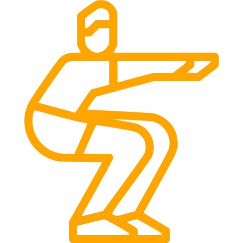
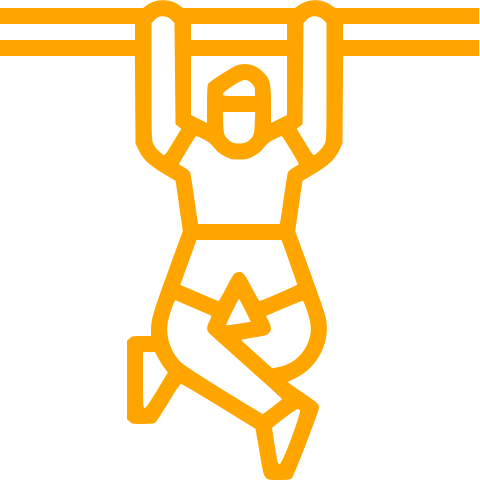
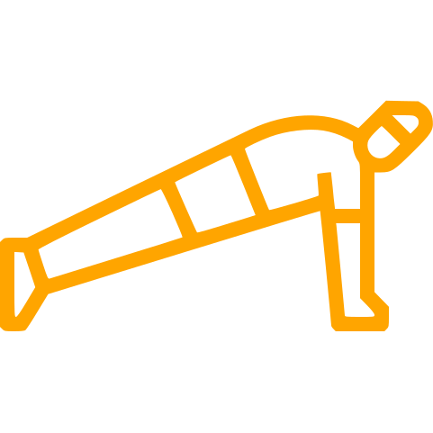
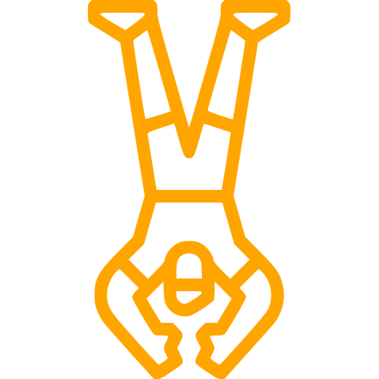
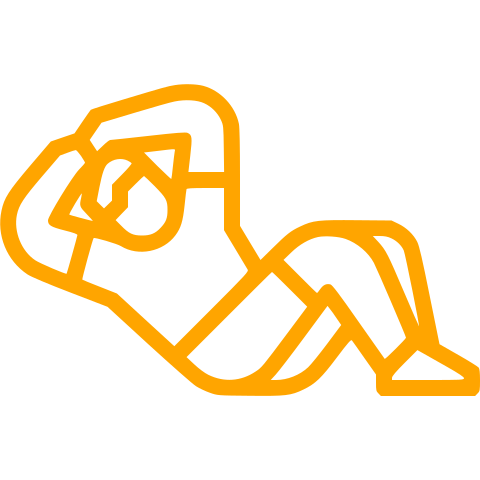

# [:back:][back] $\textsf{\color{orange}{MOVEMENTS}}$

> ##  [Squat](squat.md)
>
> ##  [Pull-up](pull-up.md)
>
> ##  [Push-up](push-up.md)
>
> ##  [Vertical push-up](vertical-push-up.md)
>
> ##  [Abdominals](abdominal.md)

[back]: ../training.md

