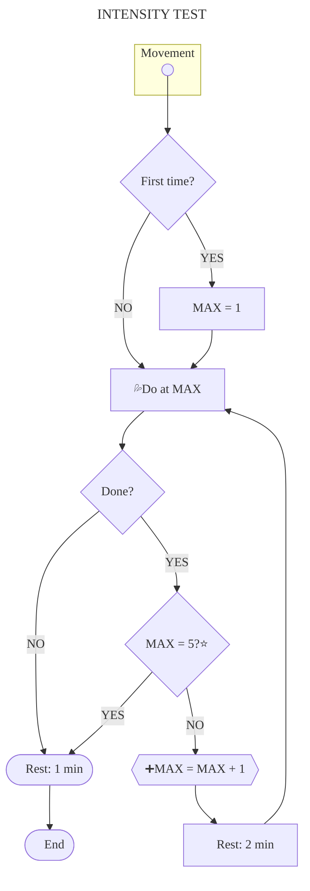

# $\textsf{\color{orange}{INTENSITY}}$

The amount of energy expended per exercise or its difficulty, which is measured from 1 to 5 and determines which exercise to perform for the [basic movements](../movements/movements.md)\.

## Test

To know the maximum intensity of each movement it is necessary to develop the following test:

### :fire: Warm-up

+ [ ] **`25 rep`** &emsp;|&emsp; Jumping Jack
+ [ ] **`25 rep`** &emsp;|&emsp; Mountain climber
+ [ ] **`25 rep`** &emsp;|&emsp; Reverse mountain climber
+ [ ] **`02 min`** &emsp;|&emsp; Skipping

### :sweat_drops: Work-out

For each movement, where MAX is the intensity reached \(see [table](#level)\), do the following:

### :snowflake: Cool-down

+ [ ] **`02 min`** &emsp;|&emsp; Jumping rope

## Level

|Movement / Level|1     |2     |3     |4     |5     |
|:------------------|:----:|:----:|:----:|:----:|:----:|
|Abdominal          |30 rep|30 rep|25 rep|15 rep|10 rep|
|Pull-up            |[^pul]|10 rep|10 rep|08 rep|03 rep|
|Push-up            |30 rep|30 rep|30 rep|30 rep|10 rep|
|Squat              |30 rep|30 rep|30 rep|15 rep|10 rep|
|Vertical push-up   |45 sec|45 sec|10 rep|10 rep|10 rep|
> _Table with criteria to reach intensity levels._

[^pul]: 45 sec active hung; 20 sec isometric position\.

