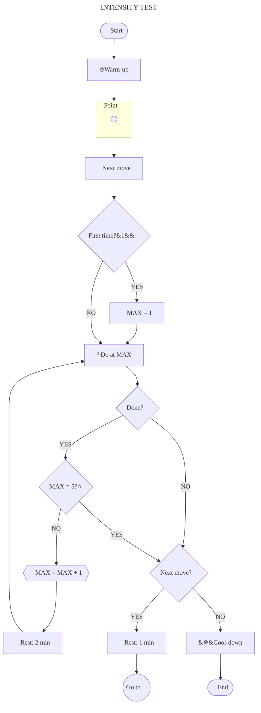

# [:back:][back] $\textsf{\color{orange}{CHART: INTENSITY TEST}}$

With the movements of abdominal, pull-up, push-up, squat and vertical push-up, do\:

```mermaid
---
title: INTENSITY TEST
---

%%{
    init: {
        "fontFamily": "lucida console",
        "flowchart": {
            "htmlLabels": true,
            "curve": "StepAfter"
        }
    }
}%%

flowchart TB
    0(["#127937;Start"])
    1["#128293;Warm-up"]
    3["#128170;Next move"]
    4{"First time?&#49;&#65039;&#8419;"}
    4Y["#128304;MAX = 1"]
    5["#128166;Do at MAX"]
    6{"Done?#127919;"}
    6Y{"MAX = 5?#11088;"}
    6YN{{"#129518;MAX = MAX + 1"}}
    6YN0["#128168;Rest: 2 min"]
    6N{"Next move?#129461;"}
    6NY["#128168;Rest: 1 min"]
    6NY0(("Go to #128308;"))
    6NN["&#10052;&#65039;Cool-down"]
    7(["#128682;End"])

    subgraph 2["Point #128308;"]
        direction TB
        point(( ))
    end

    0 --> 1 --> 2 --> 3 --> 4
    4 -- "YES" --> 4Y --> 5
    4 -- "NO " --> 5
    5 --> 6
    6 -- "YES" --> 6Y
    6 -- "NO " --> 6N
    6Y -- "YES" --> 6N
    6Y -- "NO " --> 6YN --> 6YN0 --> 5
    6N -- "YES" --> 6NY --> 6NY0
    6N -- "NO " --> 6NN --> 7
```

---

[back]: intensity.md "Intensity test"
