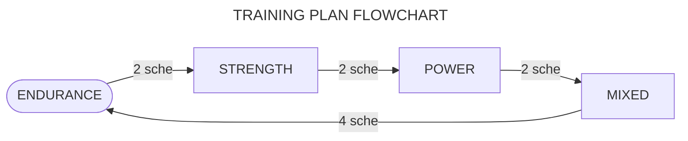

# $\textsf{\color{orange}{TRAINING}}$

## Plan

The training plan is oriented to avoid specialization, comfort and energy efficiency and aims to develop the physical qualities of **endurance**, **strength**, **power** and **flexibility** over 4 training modules.

To achieve this, in the plan the module (or type of training) changes every few schedules and ends with the mixed training module.

## Parameters

The nature of the trainings differ in the following factors:

+ **`LOAD:`** \(or intensity\) the number of difficulty of the exercises. **M** for the maximum intensity \([How is it measured?](none.md)\)\.
+ **`REPS:`** \(repetitions[^rep] or volume\) the number of times one completes an exercise.
+ **`REST:`** Days of rest that _should_ be taken per muscle group \(**upper body** and **lower body**\)\.
+ **`SCHE:`** \(or schedules\) number of schedules to be completed by type of training\.
+ **`TIME:`** \(or time of break\) a tuple formed by the rest between sets and the rest between exercises in seconds[^sec]\.
+ **`VELO:`** \(or velocity\) speed of execution of the exercises.

## Schedule

Each module lasts for the completion of the following schedule 2 or more times.

|D1   |D2      |D3         |D4   |D5      |D6         |D7         |D8                       |D9      |
|:---:|:------:|:---------:|:---:|:------:|:---------:|:---------:|:-----------------------:|:------:|
|:leg:|:muscle:|:palm_tree:|:leg:|:muscle:|:palm_tree:|:stopwatch:|:triangular_flag_on_post:|:shield:|

Each emoji specifies a different training day:

|TRAINING DAY    |EMOJI                    |
|:---------------|:-----------------------:|
|Challenge day   |:triangular_flag_on_post:|
|Core day        |:shield:                 |
|Flexibility day |:octopus:                |
|HIIT day        |:stopwatch:              |
|Lower body day  |:leg:                    |
|Rest day        |:palm_tree:              |
|Upper body day  |:muscle:                 |

> **Note**  
> Since nowhere in this schedule is [flexibility training](none.md) specified, it is recommended to incorporate it every callenge or [HIIT][definitions] day:
>
> |:stopwatch:|:triangular_flag_on_post::octopus:|
> |-|-|
>
> |:stopwatch::octopus:|:triangular_flag_on_post:|
> |-|-|

## Sequence

A training session \(or training day\) always consists of the same sequence: first, warm-up; second, workout; third, cool-down\. Graphically:

> ### :one::fire: &rarr; :two::sweat_drops: &rarr; :three::snowflake: &#8203;
>
>> _Sequence of all training sessions._

## Notes

+ The following nomenclature is used to express the number of sets and repetitions.

> **\[sets\]** &times; **\[minimum repetitions\] - \[maximum repetitions\]**  
> or  
> **\[sets\]** &times; **\[time in seconds or minutes[^min]**\].

+ When no exercise in training is a time exercise, the word ~~rep~~ is deleted
+ The last exercises are always _optional_.

## Trainings

1. ### [**`Endurance`**](trainings/endurance.md)

    > load $\scriptsize{\textsf{\color{red}{LOW ↓}}}$  
    > reps $\scriptsize{\textsf{\color{lime}{HIG ↑}}}$  
    > rest $\scriptsize{\textsf{\color{red}{LOW ↓}}}$  
    > time $\scriptsize{\textsf{\color{red}{LOW ↓}}}$  
    > velo $\scriptsize{\textsf{\color{orange}{MED •}}}$

2. ### [**`Strength`**](trainings/strength.md)

    > load $\scriptsize{\textsf{\color{lime}{HIG ↑}}}$  
    > reps $\scriptsize{\textsf{\color{red}{LOW ↓}}}$  
    > rest $\scriptsize{\textsf{\color{lime}{HIG ↑}}}$  
    > time $\scriptsize{\textsf{\color{lime}{HIG ↑}}}$  
    > velo $\scriptsize{\textsf{\color{red}{LOW ↓}}}$

3. ### [**`Power`**](trainings/power.md)

    > load $\scriptsize{\textsf{\color{orange}{MED •}}}$  
    > reps $\scriptsize{\textsf{\color{orange}{MED •}}}$  
    > rest $\scriptsize{\textsf{\color{orange}{MED •}}}$  
    > time $\scriptsize{\textsf{\color{orange}{MED •}}}$  
    > velo $\scriptsize{\textsf{\color{lime}{HIG ↑}}}$

4. ### [**`Mixed`**](none.md)

    > All modules in one\.

5. ### [**`Flexibility`**](trainings/flexibility.md)

jkk

[^min]: Abbreviated as "min"\.

[^rep]: Abbreviated as "rep"\.

[^sec]: Abbreviated as "sec"\.

[definitions]: definitions.md
