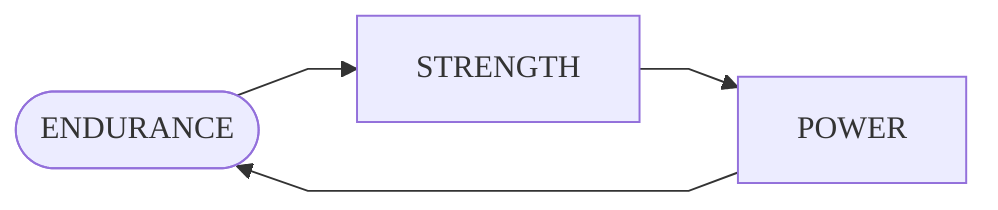

# $\textsf{\color{orange}{WORKOUT}}$

## Structure

The training plan structure is oriented to avoid specialization, confort and energy efficiency, so constantly alternate the focus of training: endurance, strength, power and flexibility\.

## Parameters

In addition to load and repetitions [^rep], the nature of the trainings also differ in the following factors:

+ **`LEVEL:`** The level of difficulty achieved in the basic exercises \([squat](movements/squat.md), [pull-up](movements/pull-up.md), [push-up](movements/push-up.md), [vertical push-up](movements/v-push-up.md) and [abdominals](movements/abs.md)\); M for the maximum level \(medium load\)\.
+ **`TIMER:`** Seconds [^sec] or minutes [^min] of rest between sets or supersets\.
+ **`BREAK:`** Days of rest for muscular group\.
+ **`WEEKS:`** Number of schedules to complete by training module\.

## Schedule

Each module lasts for the completion of two **2** schedules of more than 7 days \(see the [schedule for each training](#modules)\)\.

> **Note**  
> Since there is no flexibility module and it is not specified in any schedule, it is recommended to incorporate flexibility training sessions every resistance or [HIIT][definitions] day\.

## Sequence

The training always consists of the same sequence: first, warm-up; second, exercises by muscle group; third, cool-down\. Graphically:

> ### :one: :sweat_drops: &rarr; :two: :muscle: &rarr; :three: :snowflake: &#8203;
>
>> _Sequence of a normal training session._

## Modules

1. ### [**`Endurance`**](trainings/endurance.md)

    > #### load `LOW` &#8595; - repetitions `HIG` &#8593;

2. ### [**`Strength`**](trainings/strength.md)

    > #### load `HIG` &#8593; - repetitions `LOW` &#8595;

3. ### [**`Power`**](trainings/power.md)

    > #### load `MID` &#9679; - repetitions `MID` &#9679;

[^min]: Abbreviated as "min"\.

[^rep]: Abbreviated as "rep"\.

[^sec]: Abbreviated as "sec"\.

[definitions]: definitions.md
