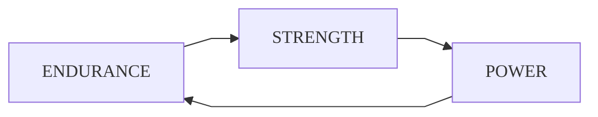

# <accent>Workout</accent>

## Structure

The training plan structure is oriented to avoid specialization, confort and energy efficiency, so constantly alternate the focus of training: endurance, strength, power and flexibility.

 

## Parameters

In addition to load and repetitions [^rep], the nature of the trainings also differ in the following factors:

- <mono>**Level:**</mono> The level of difficulty achieved in the basic exercises ([squat](movements/squat.md), [pull-up](movements/pull-up.md), [push-up](movements/push-up.md), [vertical push-up](movements/v-push-up.md) and [abdominals](movements/abs.md)); M for the maximum level (medium load).
- <mono>**Timer:**</mono> Seconds [^sec] or minutes [^min] of rest between sets or supersets.
- <mono>**Break:**</mono> Days of rest for muscular group.
- <mono>**Weeks:**</mono> Number of schedules to complete by training module.

## Schedule

Each module lasts for the completion of two **2** schedules of more than 7 days \(see the [schedule for each training](#modules)\).

> :exclamation: Since there is no flexibility module and it is not specified in any schedule, it is recommended to incorporate flexibility training sessions every resistance or [HIIT][definitions] day.

## Sequence

The training always consists of the same sequence: first, warm-up; second, exercises by muscle group; third, cool-down. Graphically:

>> ### :one: :sweat_drops: &rarr; :two: :muscle: &rarr; :three: :snowflake:  
>
> A normal training session

## Modules

1. ### <mono>[**Endurance**](trainings/endurance.md)</mono>: load <low>`LOW` &nbsp; &#8595;</low> - repetitions <hig>`HIGH` &#8593;</hig>

2. ### <mono>[**Strength**](trainings/strength.md)</mono>: &nbsp; load <hig>`HIGH` &#8593;</hig> - repetitions <low>`LOW` &nbsp; &#8595;</low>

3. ### <mono>[**Power**](trainings/power.md)</mono>: &emsp;&emsp; load <med>`MID` &nbsp;&#9679;</med> - repetitions <med>`MID` &nbsp; &#9679;</med>

[^min]: Abbreviated as "min".

[^rep]: Abbreviated as "rep".

[^sec]: Abbreviated as "sec".

[definitions]: definitions.md

