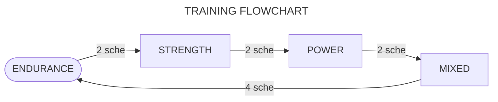

# $\textsf{\color{orange}{WORKOUT}}$

## Structure

The training plan is oriented to avoid specialization, comfort and energy efficiency and aims to develop the physical qualities of **endurance**, **strength**, **power** and **flexibility**.

To achieve this every few schedules the type of training changes and ends with a mixed training module.

## Parameters

The nature of the trainings differ in the following factors:

+ **`LOAD:`** \(or intensity\) the number of difficulty of the exercises. M for the maximum intensity \([How is it measured?](none.md)\)\.
+ **`REPS:`** \(repetitions [^rep] or volume\) the number of times one completes an exercise.
+ **`REST:`** Days of rest that _should_ be taken per muscle group\.
+ **`SCHE:`** \(or schedules\) number of schedules to complete by training module\.
+ **`TIME:`** \(or time of break\) a tuple formed by the seconds [^sec] or minutes [^min] of rest between sets and the seconds or minutes of rest between exercises\.

## Schedule

Each program lasts for the completion of the following schedule 2 or more times.

|D1   |D2      |D3         |D4   |D5      |D6         |D7   |D8    |D9             |
|:---:|:------:|:---------:|:---:|:------:|:---------:|:---:|:----:|:-------------:|
|:leg:|:muscle:|:palm_tree:|:leg:|:muscle:|:palm_tree:|:zap:|:fire:|:chocolate_bar:|

Each emoji specifies a type of training:

|TYPE OF TRAINING|EMOJI             |
|:---------------|:----------------:|
|Leg day         |:leg:             |
|Arm/back day    |:muscle:          |
|Rest day        |:palm_tree:       |
|Callenge day    |:fire:            |
|HIIT day        |:zap:             |
|Abs day         |:chocolate_bar:   |
|Flexibility day |:man_cartwheeling:|

> **Note**  
> Since nowhere in this schedule is flexibility training specified, it is recommended to incorporate [flexibility](none.md) training sessions every callenge and\/or [HIIT][definitions] day:
>
> |:fire: :man_cartwheeling:|:zap:|
> |-|-|
>
> |:fire:|:zap: :man_cartwheeling:|
> |-|-|
>
> |:fire: :man_cartwheeling:|:zap: :man_cartwheeling:|
> |-|-|

## Sequence

The training always consists of the same sequence: first, warm-up; second, exercise; third, cool-down\. Graphically:

> ### :one: :sweat_drops: &rarr; :two: :running: &rarr; :three: :snowflake: &#8203;
>
>> _Sequence of a normal training session._

Apart of above, the following nomenclature is used to express the sets and repetitions:

> **sets** &times; **range of repetitions**  
> or  
> **sets** &times; **range of time**.

When no exercise in the training is isometric, the word ~~rep~~ is deleted; the last exercises are always _optional_.

## Modules

1. ### [**`Endurance`**](trainings/endurance.md)

    > load $\scriptsize{\textsf{\color{red}{LOW ↓}}}$
    > reps $\scriptsize{\textsf{\color{lime}{HIG ↑}}}$
    > rest $\scriptsize{\textsf{\color{red}{LOW ↓}}}$
    > time $\scriptsize{\textsf{\color{red}{LOW ↓}}}$

2. ### [**`Strength`**](trainings/strength.md)

    > load $\scriptsize{\textsf{\color{lime}{HIG ↑}}}$
    > reps $\scriptsize{\textsf{\color{red}{LOW ↓}}}$
    > rest $\scriptsize{\textsf{\color{lime}{HIG ↑}}}$
    > time $\scriptsize{\textsf{\color{lime}{HIG ↑}}}$

3. ### [**`Power`**](trainings/power.md)

    > load $\scriptsize{\textsf{\color{orange}{MED •}}}$
    > reps $\scriptsize{\textsf{\color{orange}{MED •}}}$
    > rest $\scriptsize{\textsf{\color{orange}{MED •}}}$
    > time $\scriptsize{\textsf{\color{orange}{MED •}}}$

4. ### [**`Mixed`**](none.md)

[^min]: Abbreviated as "min"\.

[^rep]: Abbreviated as "rep"\.

[^sec]: Abbreviated as "sec"\.

[definitions]: definitions.md
