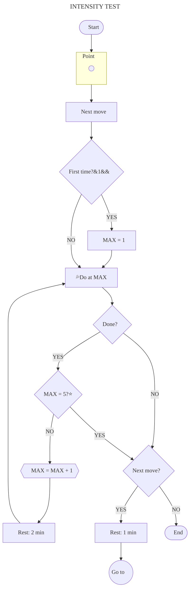

# Hola

```mermaid
---
title: INTENSITY TEST
---

%%{
    init: {
        "fontFamily": "lucida console",
        "flowchart": {
            "htmlLabels": true,
            "curve": "StepAfter"
        }
    }
}%%

flowchart TB
    0(["#127937;Start"])
    1(( ))
    2["#128170;Next move"]
    3{"First time?&#49;&#65039;&#8419;"}
    3Y["#128304;MAX = 1"]
    4["#128166;Do at MAX"]
    5{"Done?#127919;"}
    5Y{"MAX = 5?#11088;"}
    5YN{{"#129518;MAX = MAX + 1"}}
    5YN0["#128168;Rest: 2 min"]
    5N{"Next move?#129461;"}
    5NY["#128168;Rest: 1 min"]
    5NY0(("Go to #128308;"))
    5NN(["#128682;End"])    

    subgraph mov["Point #128308;"]
        direction TB
        1
    end

    0 --> mov --> 2 --> 3
    3 -- "YES" --> 3Y --> 4
    3 -- "NO " --> 4
    4 --> 5
    5 -- "YES" --> 5Y
    5 -- "NO " --> 5N
    5Y -- "YES" --> 5N
    5Y -- "NO " --> 5YN --> 5YN0 --> 4
    5N -- "YES" --> 5NY --> 5NY0
    5N -- "NO " --> 5NN
```
