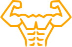

# [:arrow_left:][prev] $\color{orange}\textsf{PULL-UP}$ [:arrow_right:][next]

![imag]

`TYPE: UPPER BODY`

## Levels

1. Active hang
2. Assisted pull-up
3. Pull-up
4. One arm assisted pull-up
5. One arm pull-up :star:

---

<!-- internal -->
[next]: push-up.md "Push-up"
[prev]: abdominal.md "Abdominal"

<!-- images -->
[imag]: ../images/pull-up.svg
