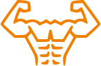

# [:arrow_left:][prev] $\color{#F08000}\textsf{PUSH-UP}$ [:arrow_right:][next]

[![icon]](#levels)

`TYPE: UPPER BODY`

## Levels

1. Desk push-up
2. Knee push-up
3. Push-up
4. Decline push-up
5. One arm push-up :star:

---

<!-- predefined -->
[next]: squat.md "Squat"
[prev]: pull-up.md "Pull-up"

<!-- icons -->
[icon]: ../icons/push-up.svg
