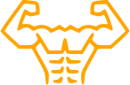

# [:arrow_left:][prev] $\color{orange}\textsf{VERTICAL PUSH-UP}$ [:arrow_right:][next]

![imag]

`TYPE: UPPER BODY`

## Levels

1. Tripod push-up
2. Headstand
3. Decline pike push-up
4. Handstand push-up
5. Deep handstand push-up :star:

---

<!-- internal -->
[next]: movements.md "Movements"
[prev]: squat.md "Squat"

<!-- images -->
[imag]: ../images/vertical-push-up.svg
