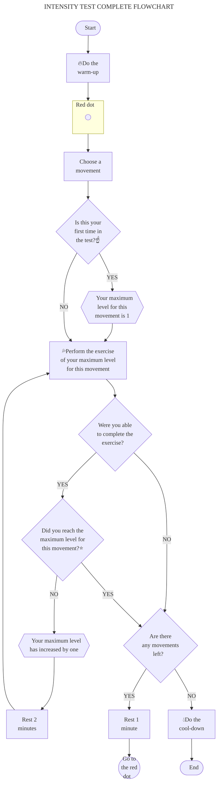

# [:back:][back] $\color{#F08000}\textsf{FLOWCHART: INTENSITY TEST}$

With the 5 [movements] do\:

---

<!-- predefined -->
[back]: intensity.md "Intensity test"

<!-- named -->
[movements]: ../movements/
