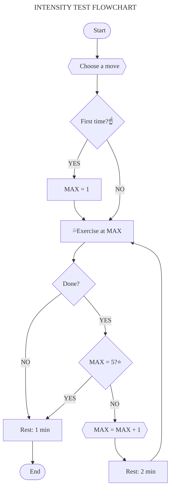

# [:back:][back] $\color{#F08000}\textsf{INTENSITY TEST}$

> ## Intensity
>
> _The amount of energy expended per exercise or its difficulty\._ Is measured from 1 to 5 and and determine which of the 5 exercises to perform for each basic movement\.
>
> **Warning**  
> Know the 5 [movements] before taking the test\!

## Test

### :fire: Warm\-up

+ [ ] **`20 rep`** &emsp;|&emsp; Jumping Jack
+ [ ] **`20 rep`** &emsp;|&emsp; Mountain climber
+ [ ] **`20 rep`** &emsp;|&emsp; Reverse mountain climber
+ [ ] **`01 min`** &emsp;|&emsp; Skipping

### :sweat_drops: Work\-out

With the following [movements]\:

+ Squat
+ Pull-up
+ Abdominal
+ Push-up
+ Vertical pull-up

\.\.\. do the following\:

1. Identify your maximum level\.
    1. If this is your first time, your maximum level is 1\.
1. Do the exercise at your maximum level\.
    1. Look at the [table] to find out how many reps to do\.
1. Update the level of the exercise if you succeeded in doing it\.
    1. Rest for 2 minutes\.
    1. Go back to step two\.
1. Rest one minute if you did not succeed\.
    1. Do all of the above for the next movement\.
1. Finish if there are no more movements\.

### :snowflake: Cool\-down

+ [ ] **`02 min`** &emsp;|&emsp; Jumping rope

## Levels

|Movement \/ Level      |1     |2     |3     |4     |5     |
|:-------------------------|:----:|:----:|:----:|:----:|:----:|
|**Abdominal**             |30 rep|30 rep|25 rep|15 rep|10 rep|
|**Pull\-up**              |[^pul]|10 rep|10 rep|08 rep|03 rep|
|**Push\-up**              |30 rep|30 rep|30 rep|30 rep|10 rep|
|**Squat**                 |30 rep|30 rep|30 rep|15 rep|10 rep|
|**Vertical push\-up**     |45 sec|45 sec|10 rep|10 rep|10 rep|
> _Table\: criteria to reach intensity levels\._

## Flowchart

A graphic summary of the workout \(:sweat_drops:\)\.

Click [here][chart] to see the complete chart\.

[^pul]: `45 sec | active hung` \& `20 sec | iso hold`\.

---

<!-- predefined -->
[back]: ../training-1.md "Training 1"

<!-- named -->
[table]: #levels "Criteria table"
[movements]: ../movements/movements.md "Movements"

<!-- charts -->
[chart]: chart-intensity-test.md "Complete intensity test"
