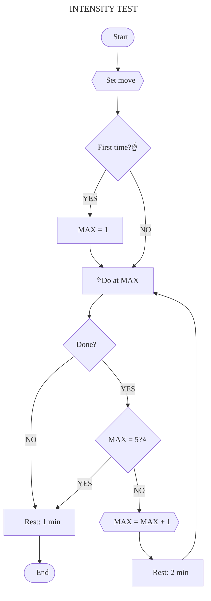

# [:back:][back] $\color{#F08000}\textsf{INTENSITY TEST}$

> ## Intensity
>
> _The amount of energy expended per exercise or its difficulty\._ Is measured from 1 to 5 and and determine which of the 5 exercises to perform for each basic movement\.
>
> **Warning**  
> Know the 5 [movements] before taking the test\!

## Test

### :fire: Warm-up

+ [ ] **`25 rep`** &emsp;|&emsp; Jumping Jack
+ [ ] **`25 rep`** &emsp;|&emsp; Mountain climber
+ [ ] **`25 rep`** &emsp;|&emsp; Reverse mountain climber
+ [ ] **`02 min`** &emsp;|&emsp; Skipping

### :sweat_drops: Work-out

For each movement, where `MAX` is the intensity reached \(see [table 1]\), do the following\:

Click [here][int-cht] to see the complete chart\.

### :snowflake: Cool-down

+ [ ] **`02 min`** &emsp;|&emsp; Jumping rope

## Levels

|Movement \/ Level     |1     |2     |3     |4     |5     |
|:------------------------|:----:|:----:|:----:|:----:|:----:|
|Abdominal                |30 rep|30 rep|25 rep|15 rep|10 rep|
|Pull-up                  |[^pul]|10 rep|10 rep|08 rep|03 rep|
|Push-up                  |30 rep|30 rep|30 rep|30 rep|10 rep|
|Squat                    |30 rep|30 rep|30 rep|15 rep|10 rep|
|Vertical push-up         |45 sec|45 sec|10 rep|10 rep|10 rep|
> _Table 1\: criteria to reach intensity levels._

[^pul]: 45 sec active hung; 20 sec isometric position\.

---

<!-- predefined -->
[back]: tests.md "Tests"

<!-- named -->
[table 1]: #levels "Criteria table"
[movements]: ../movements/movements.md "Movements"

<!-- charts -->
[int-cht]: ../others/chart-intensity-test.md "Complete intensity test"
