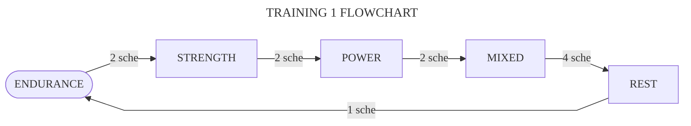

#   $\color{#F08000}\textsf{TRAINING 1}$

## Tour

> Read me, please :eye::lips::eye: &#8203;

It is suggested to view the content as follows\:

[_MOVEMENTS_](#movements) **&#8702;**
[_INTENSITY TEST_](#intensity) **&#8702;**
[_PLAN*_](#plan) **&#8702;**
[_SCHEDULE_](#schedule) **&#8702;**
[_SEQUENCE_](#sequence) **&#8702;**
[_NOTES_](#notes) **&#8702;**
[_PARAMETERS_](#parameters) **&#8702;**
[_MODULES_](#modules)

## Plan

`TYPE: CALISTHENICS`

The training 1 plan is oriented to avoid specialization, comfort and energy efficiency and aims to develop the physical qualities of **endurance**, **strength**, **power** and **flexibility** over 11 schedules\.

To achieve this, it is proposed to execute a different training module \(focused on a particular physical quality\) every 2 schedules and to finish with a mixed module of 4 schedules and a rest schedule\.

## Parameters

The nature of the modules differs in the following factors\:

+ **`LOAD:`** \(or intensity [\[How is it measured?\]][intensity test]\) the number of difficulty of the exercises\. **MAX** for the maximum intensity\.
+ **`REPS:`** \(repetitions[^rep] or volume\) the number of times one completes an exercise\.
+ **`REST:`** Days of rest that _should_ be taken per muscle group \(**upper body** and **lower body**\)\.
+ **`SCHE:`** \(or schedules\) number of schedules to be completed by training\.
+ **`TIME:`** \(or time of break\) a tuple formed by the rest between sets and the rest between exercises in seconds[^sec] or minutes[^min]\.
+ **`VELO:`** \(or velocity\) speed of execution of the exercises\.

## Schedule

Each module lasts for the completion of the following schedule 2 or more times\.

|D1   |D2      |D3         |D4   |D5      |D6         |D7         |D8      |D9         |
|:---:|:------:|:---------:|:---:|:------:|:---------:|:---------:|:------:|:---------:|
|:leg:|:muscle:|:palm_tree:|:leg:|:muscle:|:palm_tree:|:stopwatch:|:shield:|:palm_tree:|

Each emoji specifies a different workout\:

|WORKOUT    |EMOJI                    |
|:----------|:-----------------------:|
|Challenge  |:triangular_flag_on_post:|
|Core       |:shield:                 |
|Flexibility|:octopus:                |
|[HIIT][h]  |:stopwatch:              |
|Lower body |:leg:                    |
|Rest       |:palm_tree:              |
|Upper body |:muscle:                 |

> **Note**  
>> **About flexibility day :octopus:**  
>> Since [flexibility] training is not explicitly mentioned anywhere, it is recommended to incorporate it after each hiit session\.
>> |:stopwatch::octopus:|
>> |--------------------|
> ---
>> **About challenge workout :triangular_flag_on_post:**  
>> It is optional, but in case it is incorporated, it is suggested to do it after the core training\.
>> |:shield::triangular_flag_on_post:|
>> |---------------------------------|

:warning: Understanding the demands of challenge and HIIT workouts, you may initially to consider the following schedule:
  

|D1   |D2      |D3         |D4   |D5      |D6         |D7      |
|:---:|:------:|:---------:|:---:|:------:|:---------:|:------:|
|:leg:|:muscle:|:palm_tree:|:leg:|:muscle:|:palm_tree:|:shield:|

## Sequence

A workout session \(or day\) always consists of the same sequence\: first, warm\-up; second, workout; third, cool\-down\. Graphically\:

> ### :one::fire: &rarr; :two::sweat_drops: &rarr; :three::snowflake: &#8203;
>
> _Sequence of all workout sessions._

## Notes

+ The following nomenclature is used to express the number of sets and repetitions, as well as their ranks\.

For repetition exercises:

> **\[repetitions\]**  
> or  
> **\[sets\]** &times; **\[repetitions\]**  
> or  
> **\[sets\]** &times; **\[minimum repetitions\] \- \[maximum repetitions\]**

For time exercises:

> **\[time\]**  
> or  
> **\[sets\]** &times; **\[time\]**  
> or  
> **\[sets\]** &times; **\[minimum time\] \- \[maximum time\]**

+ When no exercise in workout is a time exercise, the word ~~rep~~ is deleted\.
+ The last exercises with italic emphasis are always _optional_\.

## [Modules]

> **Warning**  
> Each time at the beginning of this 11\-week training, the [intensity test](intensity) must be performed\.

See [here][endurance] the first module\.

## [Movements]

The 5 basic movements from which the other exercises of the program are derived\.

## Tests

+ ### [Intensity]

---

## [:back:][back] [:soon:][soon]

[^min]: Abbreviated as "min"\.

[^rep]: Abbreviated as "rep"\.

[^sec]: Abbreviated as "sec"\.

<!-- predefined -->
[back]: ../home.md "Home"
[soon]: modules/modules.md "Modules"

<!-- glossary -->
[h]: ../glossary.md#h "H"

<!-- named -->
[endurance]: modules/endurance.md "Endurance module"
[flexibility]: modules/flexibility.md "Flexibility module"
[intensity]: tests/intensity.md "Intensity test"
[modules]: modules/modules.md "Modules"
[movements]: movements/movements.md "Movements"
