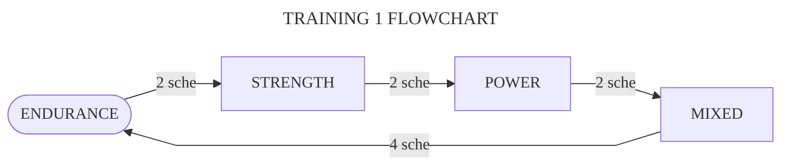

# [][tra1] $\color{orange}\textsf{TRAINING 1}$

## Plan

`TYPE: CALISTHENICS`

The training 1 plan is oriented to avoid specialization, comfort and energy efficiency and aims to develop the physical qualities of **endurance**, **strength**, **power** and **flexibility** over 10 schedules\.

To achieve this, it is proposed to execute a different training module \(focused on a particular physical quality\) every 2 schedules and to finish with a mixed module of 4 schedules\.

## Parameters

The nature of the modules differs in the following factors\:

+ **`LOAD:`** \(or intensity [\[How is it measured?\]][inte]\) the number of difficulty of the exercises\. **MAX** for the maximum intensity\.
+ **`REPS:`** \(repetitions[^rep] or volume\) the number of times one completes an exercise\.
+ **`REST:`** Days of rest that _should_ be taken per muscle group \(**upper body** and **lower body**\)\.
+ **`SCHE:`** \(or schedules\) number of schedules to be completed by training\.
+ **`TIME:`** \(or time of break\) a tuple formed by the rest between sets and the rest between exercises in seconds[^sec] or minutes[^min]\.
+ **`VELO:`** \(or velocity\) speed of execution of the exercises\.

## Schedule

Each module lasts for the completion of the following schedule 2 or more times\.

|D1   |D2      |D3         |D4   |D5      |D6         |D7         |D8                       |D9      |
|:---:|:------:|:---------:|:---:|:------:|:---------:|:---------:|:-----------------------:|:------:|
|:leg:|:muscle:|:palm_tree:|:leg:|:muscle:|:palm_tree:|:stopwatch:|:triangular_flag_on_post:|:shield:|

Each emoji specifies a different workout day\:

|DAY             |EMOJI                    |
|:---------------|:-----------------------:|
|Challenge day   |:triangular_flag_on_post:|
|Core day        |:shield:                 |
|Flexibility day |:octopus:                |
|HIIT day        |:stopwatch:              |
|Lower body day  |:leg:                    |
|Rest day        |:palm_tree:              |
|Upper body day  |:muscle:                 |

> **Note**  
> Since nowhere in the schedule is the [flexibility day][flex] specified, it is recommended to incorporate a session every [HIIT][leth] day\:
>
> |:stopwatch::octopus:|
> |--------------------|

## Sequence

A workout session \(or day\) always consists of the same sequence\: first, warm-up; second, workout; third, cool-down\. Graphically\:

> ### :one::fire: &rarr; :two::sweat_drops: &rarr; :three::snowflake: &#8203;
>
>> _Sequence of all workout sessions._

## Notes

+ The following nomenclature is used to express the number of sets and repetitions\.

> **\[sets\]** &times; **\[minimum repetitions\] \- \[maximum repetitions\]**  
> or  
> **\[sets\]** &times; **\[minimum time \- maximum time\]**.

+ When no exercise in workout is a time exercise, the word ~~rep~~ is deleted\.
+ The last exercises with italic emphasis are always _optional_\.

## [Modules][modu]

> **Warning**  
> Each time at the beginning of this 10-week training, the [intensity test][inte] must be performed\.

See [here][endu] the first module\.

## [Movements][move]

The 5 basic movements from which the other exercises of the program are derived\.

## [Tests][test]

Several tests and challenges\.

---

## [:back:][back] [:soon:][endu]

[^min]: Abbreviated as "min"\.

[^rep]: Abbreviated as "rep"\.

[^sec]: Abbreviated as "sec"\.

<!-- internal -->
[back]: ../home.md "Home"
[endu]: modules/endurance.md "Endurance training"
[flex]: modules/flexibility.md "Flexibility training"
[inte]: tests/intensity.md "Intensity test"
[leth]: ../glossary.md "H"
[modu]: modules/modules.md "Modules"
[move]: movements/movements.md "Movements"
[test]: tests/tests.md "Tests"
[tra1]: training-1.md "Training 1"
