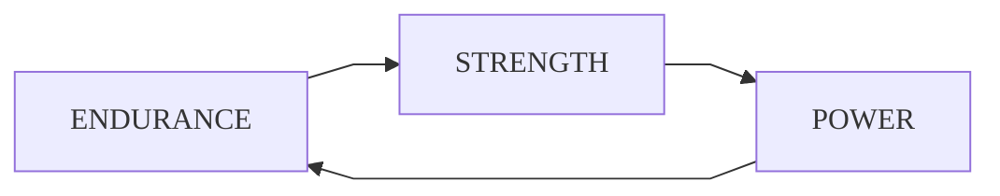

# <orange>Workout</orange>

## Structure

The training plan structure is oriented to avoid specialization, confort and energy efficiency, so constantly alternate the focus of training.

 

## Duraction

Each module lasts for the completion of two **2** schedules of more than 7 days \(see the [schedule for each training](#training-modules)\).

## Training sequence

The training always consists of the same sequence: first, warm-up; second, exercises by muscle group; third, cool-down. Graphically:

>> :one: :sweat_drops:  
>> :two: :muscle:  
>> :three: :snowflake:  
>
> or  
>
>>:sweat_drops: &rarr; :muscle: &rarr; :snowflake:

## Parameters

In addition to load and repetitions [^rep], the nature of the trainings also differ in the following factors:

- <mono>**Level:**</mono> The level of difficulty achieved in the basic exercises ([squat](squat.md), [pull-up](pull-up.md), [push-up](push-up.md), [vertical push-up](v-push-up.md) and [abdominals](abs.md)); M for the maximum level (medium load).
- <mono>**Timer:**</mono> Seconds [^sec] or minutes [^min] of rest between sets or supersets.
- <mono>**Break:**</mono> Days of rest for muscular group.
- <mono>**Weeks:**</mono> Number of schedules to complete by training module.

## Training modules

1. <mono>[**Endurance**](endurance.md)</mono>: load <green>`LOW` &nbsp; &#8595;</green> repetitions <red>`HIGH` &#8593;</red>.
2. <mono>[**Strength**](strength.md)</mono>: &nbsp; load <red>`HIGH` &#8593;</red> repetitions <green>`LOW` &nbsp; &#8595;</green>.
3. <mono>[**Power**](power.md)</mono>: &emsp;&emsp; load <yellow>`MID` &nbsp;&#9679;</yellow> repetitions <yellow>`MID` &nbsp; &#9679;</yellow>.

## Definitions

- _**HIIT**_: High-intensity Interval Training.
- _**Tabata**_: a HIIT workout that consists of performing an exercise for 20 seconds, resting for 10 and repeating the previous 8 times.

[^min]: abbreviated as "min".

[^rep]: abbreviated as "rep".

[^sec]: abbreviated as "sec".

<html>
    <head>
        <link rel='stylesheet' href='style.css'>
        
    </head>
</html>
